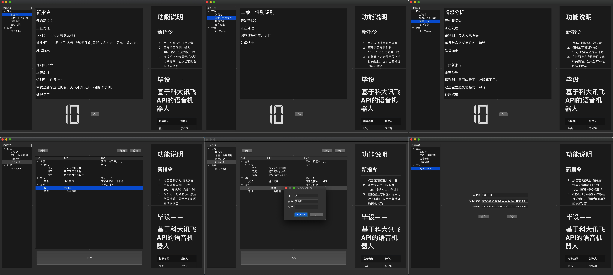
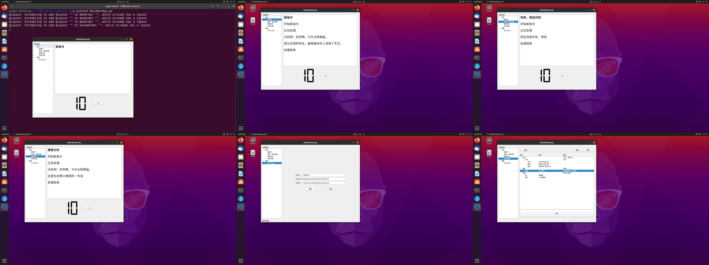

# MySiri

[TOC]

Internal test

**直接运行ui/MainWindow文件**

## 测试环境

| 环境           | 版本     |
| -------------- | -------- |
| macOS Catalina | 10.15.7  |
| PyCharm        | 2020.3.3 |
| Python         | 3.9      |

## 依赖包
见requirement.txt

## 运行截图

- macOS

- Ubuntu

## 鸣谢
- 讯飞语音API提供语音支持
- 图灵机器人API提供反馈支持
- ImageMagick提供运行截图拼接支持
